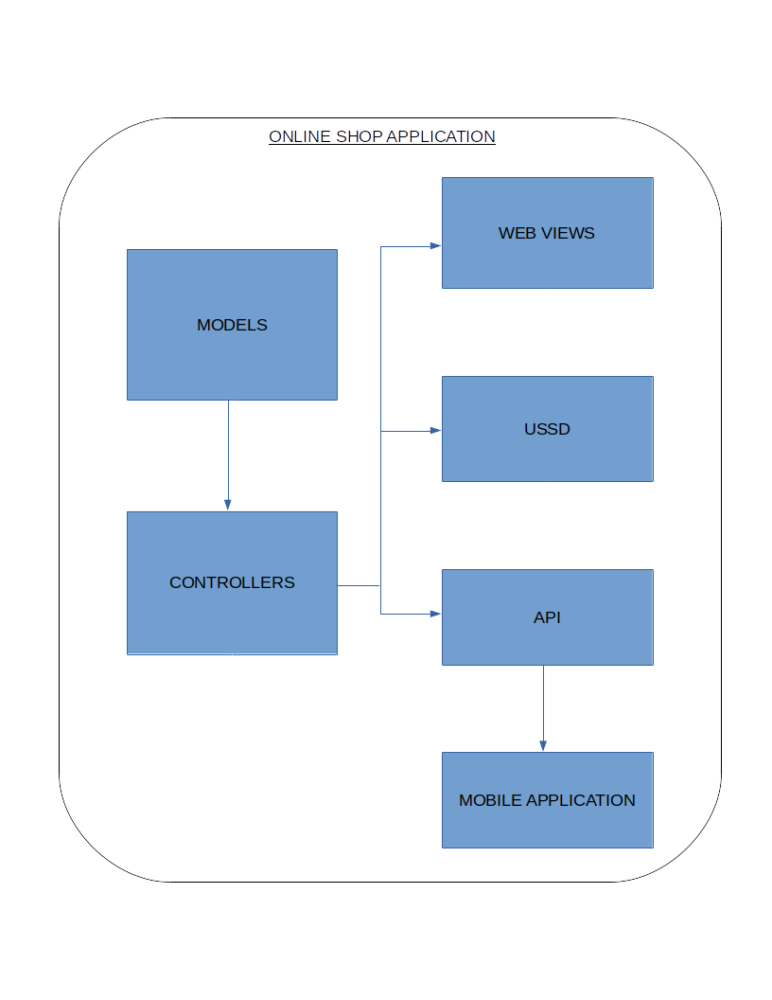

Architecture/Design
===================

The application is coded with `PHP`_  using `Laravel web application framework`_.
The framework uses a Model Controller View (MVC) architecture.

The Mobile application gets data using an API link.

.. _PHP: https://www.php.net/
.. _Laravel web application framework: https://laravel.com/

.. toctree::
    :maxdepth: 2
    :caption: Architecture Contents:

    architecture/models
    architecture/controllers
    architecture/views
    architecture/api
